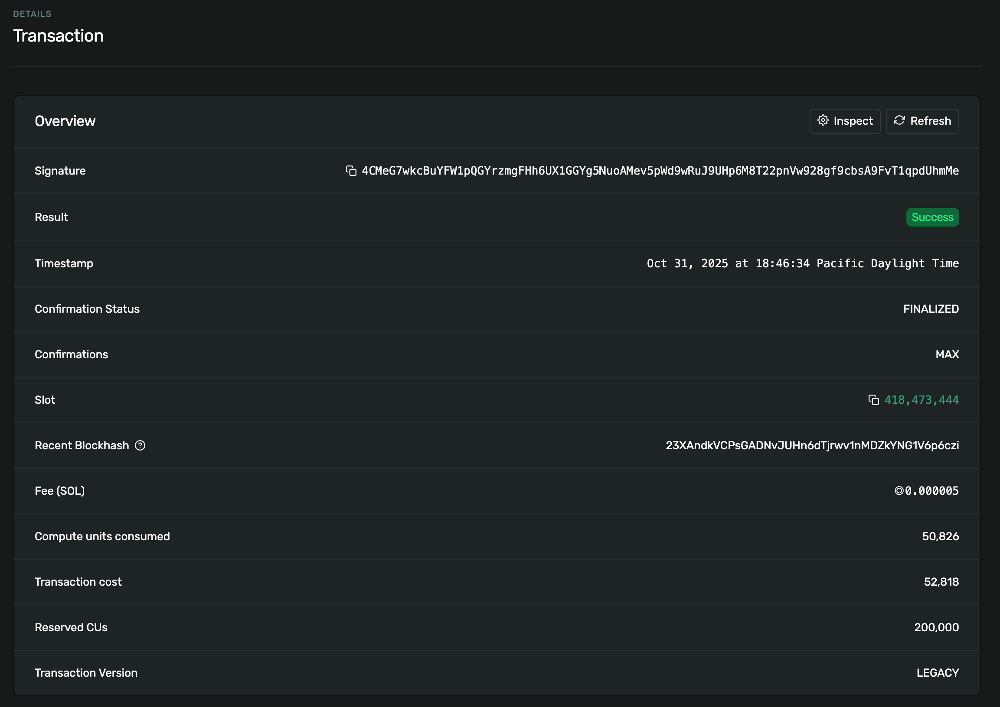
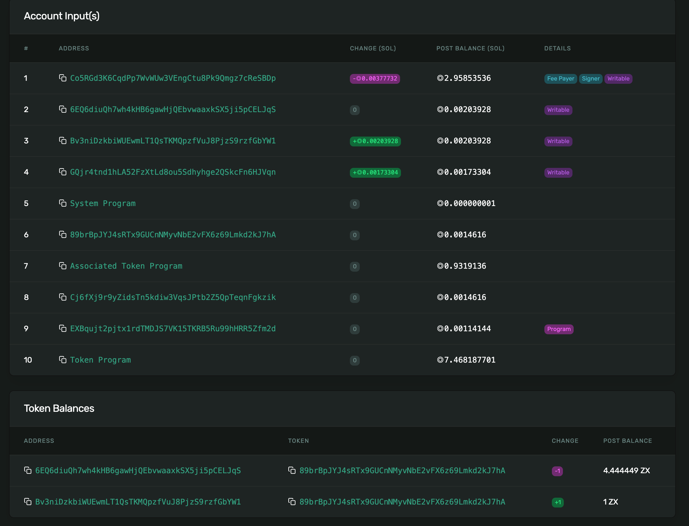
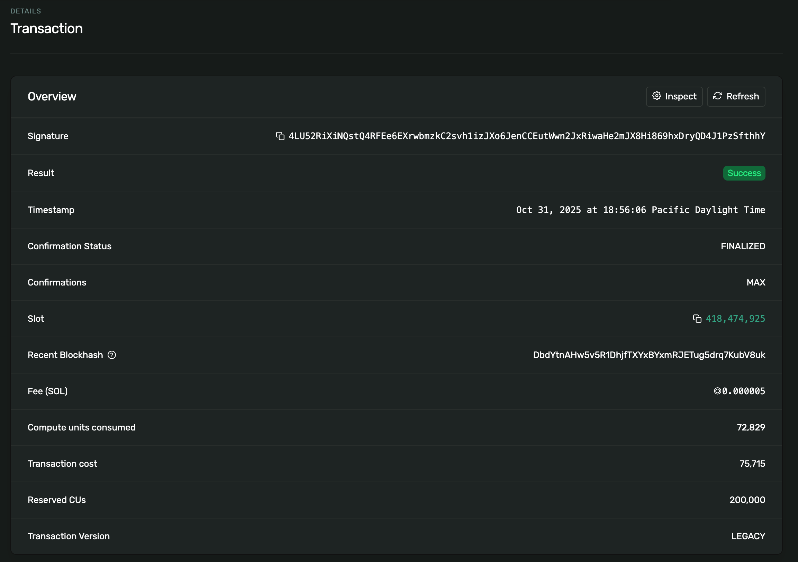
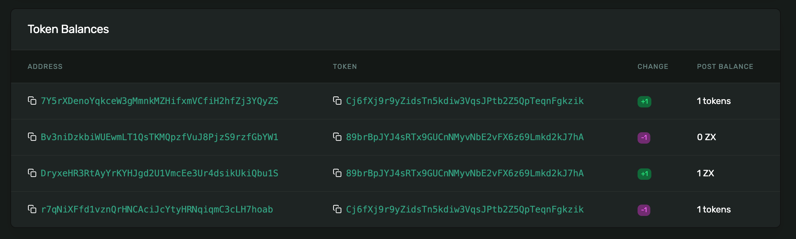

# Solana Escrow Program

This project implements a simple **1:1 Token Escrow** smart contract on **Solana Devnet** using **Anchor**.  
It enables a **Maker** to lock Token A into a vault and define the amount of Token B they want to receive.  
A **Taker** can then pay the exact Token B amount to automatically receive Token A — all in **one atomic transaction**.

---

## Features

- Initialize an **Escrow** with Maker and Taker roles.  
- Lock Token A inside a PDA-owned **Vault ATA**.  
- Define how much Token B Maker wants to receive.  
- Taker sends Token B and automatically receives Token A.  
- Fully **atomic swap** — if any step fails, the entire transaction is reverted.  
- Vault and Escrow accounts are automatically closed after settlement.

---

## Program Information

| Item | Value |
|------|-------|
| **Cluster** | Devnet |
| **Program ID** | `EXBqujt2pjtx1rdTMDJS7VK15TKRB5Ru99hHRR5Zfm2d` |
| **IDL Account** | `6oXqz8hv75ep3mNKrVkU2XE2U2ZTTMFzuvNUdxWRjkS1` |
| **Deployment Signature** | [`5nGRZT4GZR9DqJhkWZEx4i4wuqwpuUFCwDC2qbbSbFekJs8XPxN4rtTPLWv9eELrD6LM78cT4t19mVZMhqeW2x6N`](https://explorer.solana.com/tx/5nGRZT4GZR9DqJhkWZEx4i4wuqwpuUFCwDC2qbbSbFekJs8XPxN4rtTPLWv9eELrD6LM78cT4t19mVZMhqeW2x6N?cluster=devnet) |

---

## Token Information

| Token | Description | Mint Address |
|--------|--------------|---------------|
| **Token A** | Asset deposited by Maker | `89brBpJYJ4sRTx9GUCnNMyvNbE2vFX6z69Lmkd2kJ7hA` |
| **Token B** | Payment Token by Taker | `Cj6fXj9r9yZidsTn5kdiw3VqsJPtb2Z5QpTeqnFgkzik` |
| **Decimals** | 6 |
| **Exchange Rate** | 1 A : 1 B (fixed 1:1) |

---

## Escrow & Vault Details

| Item | Address / Value |
|------|------------------|
| **Escrow PDA** | `GQjr4tnd1hLA52FzXtLd8ou5Sdhyhge2QSkcFn6HJVqn` |
| **Vault ATA (Token A)** | `Bv3niDzkbiWUEwmLT1QsTKMQpzfVuJ8PjzS9rzfGbYW1` |
| **Vault Owner** | Escrow PDA |

---

## Transaction Flow

### 1. Maker Initializes Escrow  
**maker_ata_a → escrow (deposit Token A)**  
**Transaction Signature:**  
[`4CMeG7wkcBuYFW1pQGYrzmgFHh6UX1GGYg5NuoAMev5pWd9wRuJ9UHp6M8T22pnVw928gf9cbsA9FvT1qpdUhmMe`](https://explorer.solana.com/tx/4CMeG7wkcBuYFW1pQGYrzmgFHh6UX1GGYg5NuoAMev5pWd9wRuJ9UHp6M8T22pnVw928gf9cbsA9FvT1qpdUhmMe?cluster=devnet)

---

### 2. Taker Completes Exchange  
- **taker_ata_b → maker_ata_b (Token B transfer)**  
- **escrow → taker_ata_a (Token A release)**  
- **Escrow closed**

**Transaction Signature:**  
[`4LU52RiXiNQstQ4RFEe6EXrwbmzkC2svh1izJXo6JenCCEutWwn2JxRiwaHe2mJX8Hi869hxDryQD4J1PzSfthhY`](https://explorer.solana.com/tx/4LU52RiXiNQstQ4RFEe6EXrwbmzkC2svh1izJXo6JenCCEutWwn2JxRiwaHe2mJX8Hi869hxDryQD4J1PzSfthhY?cluster=devnet)

---

## Test Result
,

,

