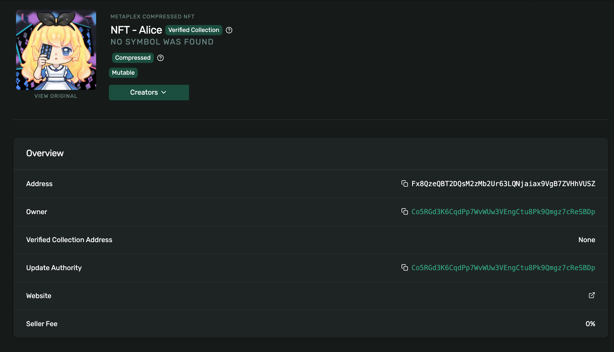
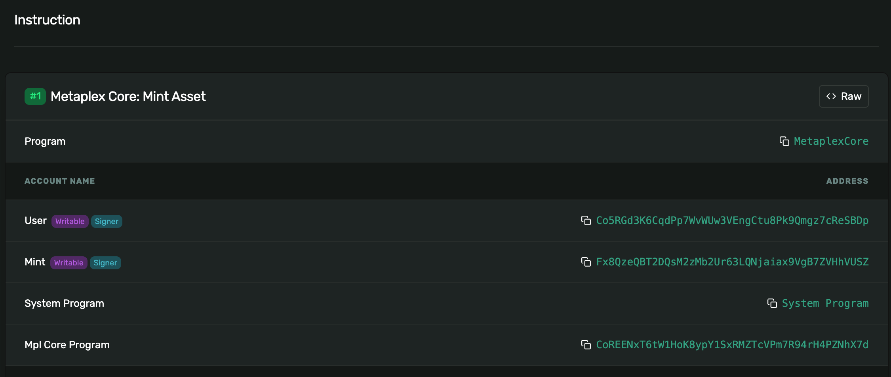
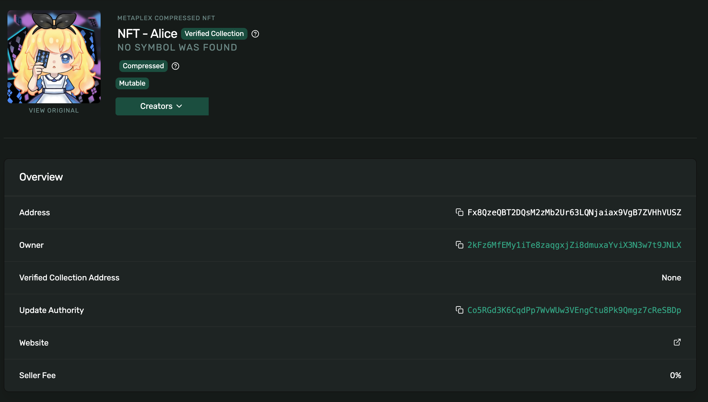

# Week 3 - NFT Minting and Trading with Metaplex Core

This project demonstrates the process of **minting and transferring NFTs on Solana Devnet** using **Metaplex Core** and **Anchor**.  

## Program Information

| Item | Value |
|------|-------|
| **Cluster** | Devnet |
| **Program ID** | `HUBjpQsy6x6ydWFq1fatHek6ktKW49uP55RdZcgzR6Ed` |
| **IDL Account** | `8pxWfrsV21dvZgcbAjkrJoPv5enRLVjPWimvC5Y3PKGu` |
| **Deployment Signature** | [`2cXAV5qFfUwk9PNYx4EqqzqAxoxq3GntjESM6NamPtBZDZ8suANELSHKZBs9JSDYsPg7zAj46c1MH3BcpE5LPqiZ`](https://explorer.solana.com/tx/2cXAV5qFfUwk9PNYx4EqqzqAxoxq3GntjESM6NamPtBZDZ8suANELSHKZBs9JSDYsPg7zAj46c1MH3BcpE5LPqiZ?cluster=devnet) |

---

## NFT Information

| Field | Value |
|--------|--------|
| **Name** | `NFT - Alice` |
| **Mint / Asset Address**  | `Fx8QzeQBT2DQsM2zMb2Ur63LQNjaiax9VgB7ZVHhVUSZ` |
| **Owner (initial)** | `Co5RGd3K6CqdPp7WvWUw3VEngCtu8Pk9Qmgz7cReSBDp` |
| **Cluster** | `Devnet` |
| **Mint Transaction Signature** | [`4BGvdkBvd3gstbxMY9Eb7MyDtLZ3L3iKXk9pj4v95ZVTREFME8GiuySxqTQtSPUerUWcJCXSTtMF6mpCT8vjW2fy`](https://explorer.solana.com/tx/4BGvdkBvd3gstbxMY9Eb7MyDtLZ3L3iKXk9pj4v95ZVTREFME8GiuySxqTQtSPUerUWcJCXSTtMF6mpCT8vjW2fy?cluster=devnet) |

## Transaction Information
| Field | Value |
|--------|--------|
| **New Owner (after transfer)** |  `2kFz6MfEMy1iTe8zaqgxjZi8dmuxaYviX3N3w7t9JNLX` |
| **Transfer Transaction** |  [`39dF4uKnteR2o5y3MJ3dQoBh1ysxXNXD9UZpH58yX3YXmP7HHaFJcgeCKFULtBfD8TevNfH5kg3FXZNhEtcdcydp`](https://explorer.solana.com/tx/39dF4uKnteR2o5y3MJ3dQoBh1ysxXNXD9UZpH58yX3YXmP7HHaFJcgeCKFULtBfD8TevNfH5kg3FXZNhEtcdcydp?cluster=devnet) |

## Test Result
,

,

## Problems with This Trading Model

When NFTs are traded directly between wallets (peer-to-peer),  
the process is simple but exposes several key issues:

| # | Problem | Description |
|---|----------|--------------|
| **1** | **Trust-based exchange** | Users must trust each other to send their NFTs. If one party fails to transfer, the other can lose their asset. |
| **2** | **No atomicity** | The two transfers happen separately (A → B, B → A), so one can succeed while the other fails. |
| **3** | **User error risk** | Manual wallet-to-wallet transfers can lead to mistakes, such as sending to the wrong address or wrong asset. |

---

## Proposed Solution: On-chain Escrow Contract

To solve these issues, we can build an **Escrow Smart Contract** on Solana.

- The escrow program temporarily **locks both NFTs** inside program-controlled accounts.  
- Once **both parties deposit** their assets, the program executes an **atomic swap** — both transfers succeed together or fail together.  
- This guarantees fairness, eliminates the need for trust, and prevents accidental loss.  

