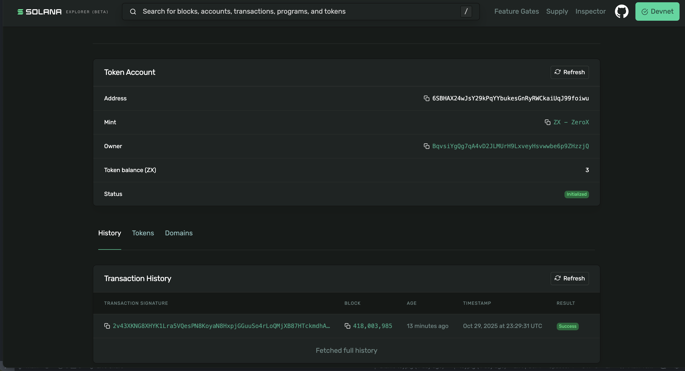

# Solana Vault Program

This project implements a simple **Vault** smart contract on Solana using **Anchor**.  
The Vault allows users to **lock SPL tokens** into a PDA-owned account, ensuring tokens cannot be moved without program authorization.

---

## Features

- Initialize a Vault for any SPL token.
- Deposit (lock) tokens into the Vault.
- Tokens are held under a **Program Derived Address (PDA)**.
- Once deposited, users can no longer directly transfer them — only via program logic.

---

## Program Information

| Item | Value |
|------|-------|
| **Cluster** | Devnet |
| **Program ID** | `BRuSQMfCARmGDq2r8zt412MnXQfoRpQzQ342mf5fUuyS` |
| **IDL Account** | `AQsG4cZUb5LhySh35dUBXRKgyS52P3bxWn8Q1Wq6LM9d` |
| **Deployment Signature** | [`2aQf5SFGB9tjAYYPFvkEUL6qoNz6FvHS5Xz6RGPbHffkamSorFxmbM4acX5KPhZi23dvMKgGKW5nmb9atW6abySy`](https://explorer.solana.com/tx/2aQf5SFGB9tjAYYPFvkEUL6qoNz6FvHS5Xz6RGPbHffkamSorFxmbM4acX5KPhZi23dvMKgGKW5nmb9atW6abySy?cluster=devnet) |

---

## SPL Token Info

| Item | Value |
|------|-------|
| **Mint Address** | `89brBpJYJ4sRTx9GUCnNMyvNbE2vFX6z69Lmkd2kJ7hA` |
| **Mint Tx Signature** | [`62PDT2uovpG9p7qqQSv8n16J4CPTnuXVouQNBGNt68LzvNVhz2VAnQuqLuHYQiB9PnnaN13KYkcN1NbqaHbkxm95`](https://explorer.solana.com/tx/62PDT2uovpG9p7qqQSv8n16J4CPTnuXVouQNBGNt68LzvNVhz2VAnQuqLuHYQiB9PnnaN13KYkcN1NbqaHbkxm95?cluster=devnet) |
| **Decimals** | 6 |
| **Initial Mint Amount** | 10 tokens |

---

## Locked Tokens in Vault

Tokens were successfully transferred to the Vault PDA and are now locked under its control.

| Item | Address / Hash |
|------|----------------|
| **Vault PDA** | `BqvsiYgQg7qA4vD2JLMUrH9LxveyHsvwwbe6p9ZHzzjQ` |
| **Vault ATA** | `6SBHAX24wJsY29kPqYYbukesGnRyRWCkaiUqJ99foiwu` |
| **Tx Signature (Lock)** | [`2v43XKNG8XHYK1Lra5VQesPN8KoyaN8HxpjGGuuSo4rLoQMjXB87HTckmdhAgE2Q2Wqait5572UHkspPVpUjzMzZ`](https://explorer.solana.com/tx/2v43XKNG8XHYK1Lra5VQesPN8KoyaN8HxpjGGuuSo4rLoQMjXB87HTckmdhAgE2Q2Wqait5572UHkspPVpUjzMzZ?cluster=devnet) |
| **Locked Amount** | 3 tokens |
| **Mint** | `89brBpJYJ4sRTx9GUCnNMyvNbE2vFX6z69Lmkd2kJ7hA` |

📸 **Screenshot Proof:**  

